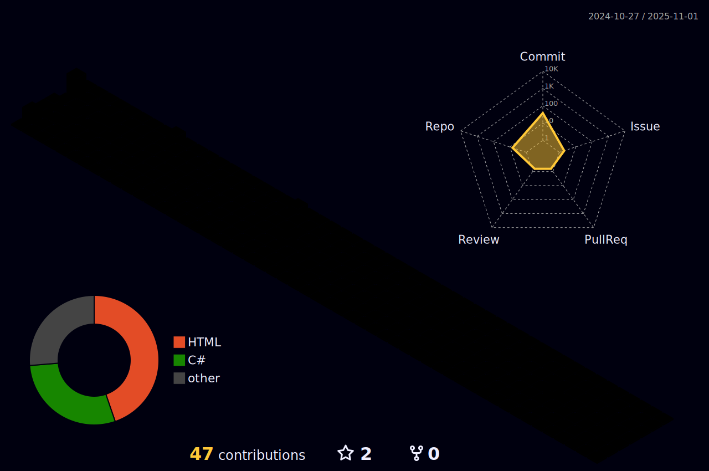

## 🏄‍♂️ TingHow
- 👋 Hi, I’m Tiến Hảo nè
- 👀 I’m interested in Web API and Mobile Application
- 🌱 I’m currently learning mathematics and computer science
- ⚡ Fun fact: I like Guitar and Music
- 🌏 My Portfolio: <a href="https://gist.github.com/rxaviers/7360908">https://gist.github.com/rxaviers/7360908</a>
<!---
HaoNguyen2003/HaoNguyen2003 is a ✨ special ✨ repository because its `README.md` (this file) appears on your GitHub profile.
You can click the Preview link to take a look at your changes.
--->
## 🎼 my favorite song

## 🏫 My School

    

## 👜 Connect with me

## 💻 Technology Stack

  

## 🐍 Snake

  

## 🌕 Commit

## ⭐ GitHub Stats

  
  

      

